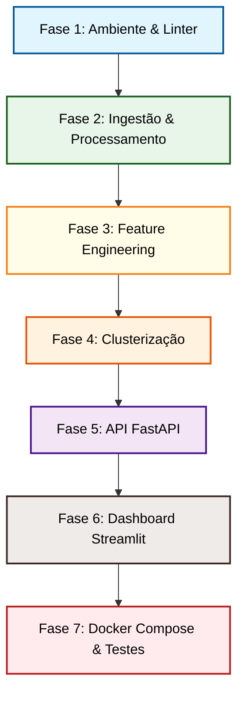

# PAM Analytics - Clusterização Agrícola do Paraná

Plataforma analítica ponta a ponta projetada para ingestão de dados históricos da Pesquisa Agrícola Municipal (PAM) via API SIDRA/IBGE, engenharia de features, modelagem não supervisionada (clusterização de perfis produtivos de soja, milho e trigo) e exposição dos resultados através de um ecossistema com API (FastAPI) e interface visual (Streamlit), totalmente containerizado com Docker Compose.

---

## 🏗️ Arquitetura do Projeto

O projeto adota uma estrutura modular focada em boas práticas de engenharia de software (Clean Code, separação de responsabilidades e reprodutibilidade):

```text
pam-analytics/
├── data/                            # Diretório de dados (raw e processed)
├── docker/                          # Configurações de containerização
├── src/                             # Código-fonte principal do projeto
│   ├── ingestion/                   # Módulo de Ingestão e Iniciação de dados (SIDRA API)
│   ├── features/                    # Módulo de Engenharia de Features temporais
│   ├── models/                      # Módulo de Modelagem e Clusterização
│   ├── api/                         # Módulo de Exposição de dados (FastAPI)
│   └── dashboard/                   # Interface Gráfica Interativa (Streamlit)
├── docker-compose.yml               # Orquestração local dos containers
└── pyproject.toml                   # Gerenciamento de dependências e padrões (Ruff/Pyright)
```

---

## 📅 Planejamento de Desenvolvimento & Cronograma

Para garantir uma entrega organizada e modularizada até a data limite (**20/07/2026**), o desenvolvimento foi dividido em fases incrementais com entregáveis diários claros:



### Detalhamento das Fases

| Fase | Período Previsto | Descrição e Objetivos | Entregável |
| :--- | :--- | :--- | :--- |
| **Fase 1: Ambiente** | 12/07 | Configuração do ambiente virtual (`.venv`), dependências e ferramentas de linter/formatter (`Ruff`). | Configuração de ambiente estável e padronizado. |
| **Fase 2: Ingestão** | 13/07 | Finalização do consumo de dados da API do SIDRA, limpeza de valores especiais e exportação dos dados estruturados em formato **Parquet**. | Arquivos `.parquet` em `data/processed/`. |
| **Fase 3: Features** | 14/07 | Desenvolvimento do pipeline de transformação temporal (cálculo de taxas de crescimento médio, tendências históricas e volatilidade de produção por município-cultura). | Script `src/features/builder.py` funcional. |
| **Fase 4: Modelagem** | 15/07 | Normalização dos dados com escaladores robustos e aplicação de algoritmos de agrupamento não supervisionado (como K-Means, K-Medoids ou misturas gaussianas) de forma isolada por cultura. Avaliação de métricas de partição. | Mapeamento município-cluster consolidado. |
| **Fase 5: API Rest** | 16/07 | Implementação dos endpoints da API FastAPI para prover séries históricas, metadados e rankings, utilizando validação Pydantic. | API respondendo localmente na porta `8000`. |
| **Fase 6: Dashboard** | 17/07 | Desenvolvimento do front-end em Streamlit para visualizações interativas de gráficos e mapas, consumindo exclusivamente os endpoints da API. | Dashboard rodando localmente na porta `8501`. |
| **Fase 7: Docker** | 18/07 | Containerização da API e do Dashboard em Dockerfiles dedicados e orquestração do ecossistema via Docker Compose. | Sistema completo inicializável com `docker compose up`. |
| **Polimento & Testes** | 19/07 | Revisão geral do código com Ruff, escrita de testes automatizados e refinamento da documentação técnica para entrega. | Repositório pronto para avaliação final. |

---

## 📝 Lista de Tarefas (TODO)

Acompanhamento do progresso das atividades para a entrega final:

- [ ] Finalizar o processamento e limpeza dos dados brutos do SIDRA para Parquet (Fase 2)
- [ ] Desenvolver o pipeline de engenharia de features temporais (Fase 3)
- [ ] Implementar os modelos de agrupamento não supervisionado por cultura (Fase 4)
- [ ] Criar os endpoints da API com FastAPI e esquemas Pydantic (Fase 5)
- [ ] Construir o dashboard interativo com Streamlit consumindo a API (Fase 6)
- [ ] Configurar os Dockerfiles e orquestração via Docker Compose (Fase 7)
- [ ] Rodar testes unitários e validações finais de estilo com `Ruff` e `Pyright`
- [ ] Atualizar a versão do projeto para `1.0.0` no `pyproject.toml` (especificação [SemVer](https://semver.org/lang/pt-BR/))
- [ ] Gerar a tag de entrega estável `v1.0.0` no Git (`git tag v1.0.0`)

