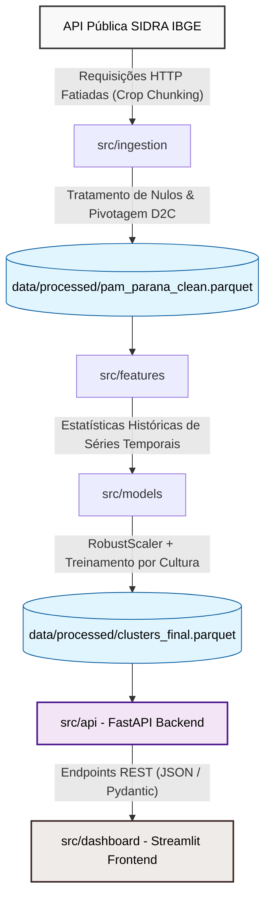

# ADR 01: Estrutura do Ecossistema e Ingestão de Dados Agrícolas

* **Status:** Aceito (Fases 1 e 2 ativas)
* **Data:** 2026-07-12
* **Autor:** Candidato (Cientista de Dados Pleno)

---

## 1. Contexto e Problema

O objetivo deste projeto é segmentar os municípios do estado do Paraná com base no seu perfil produtivo para três culturas essenciais: soja, milho e trigo, cobrindo a série histórica de 2010 a 2024. Os dados originais devem ser obtidos dinamicamente da API pública do SIDRA (Tabela 5457 - Produção Agrícola Municipal).

A API do SIDRA possui duas limitações importantes que moldam o design da solução:
1. **Limite de Volumetria:** Um teto estrito de **50.000 células** por requisição HTTP. Um único request contendo todas as variáveis, anos, municípios e produtos geraria 89.775 células, resultando em erro `HTTP 400`.
2. **Instabilidade do Servidor:** O servidor do IBGE frequentemente apresenta lentidão e falhas de conexão temporárias sob cargas altas.

---

## 2. Decisões de Arquitetura

### Decisão 1: Estrutura de Diretórios Modular (Clean Code)
Para garantir manutenibilidade e separação de responsabilidades (SRP), o projeto será estruturado em módulos desacoplados:
* `src/ingestion`: Responsável exclusivamente pela coleta, tratamento básico e persistência dos dados brutos.
* `src/features`: Responsável pela leitura de dados limpos e engenharia de features matemáticas.
* `src/models`: Responsável pelo pré-processamento escalar e modelos de clusterização.
* `src/api`: Backend FastAPI para expor os resultados analíticos estruturados.
* `src/dashboard`: Interface de visualização em Streamlit alimentada estritamente via requisições à API.

### Decisão 2: Ingestão de Dados Fatiada por Cultura (Crop-Based Chunking)
Para contornar o limite de 50.000 células, dividiremos as chamadas à API do SIDRA individualmente por produto agrícola.
* Cada consulta requisitará 15 períodos (2010-2024), 399 municípios (Paraná) e 5 variáveis para uma única cultura (ex: Soja).
* O volume por chamada cai para **29.925 células**, garantindo que as chamadas fiquem dentro do limite de segurança da API.

### Decisão 3: Tratamento de Resiliência de Rede
A classe cliente de conexão com a API (`SidraClient`) implementará um mecanismo de **retries com backoff exponencial** (atraso crescente entre tentativas). Isso evita que oscilações momentâneas de rede do IBGE interrompam a execução do pipeline de dados.

### Decisão 4: Mapeamento e Pivotagem via Códigos Imutáveis (`D2C`)
As respostas brutas da API do SIDRA contain nomes de variáveis (coluna `D2N`) propensos a alterações textuais e encoding inconsistente.
* A higienização e pivotagem dos dados serão feitas utilizando os **códigos numéricos das variáveis** (coluna `D2C`, ex: `"8331"` para Área Plantada).
* Isso garante que alterações de grafia ou acentuação feitas pelo IBGE não quebrem o pipeline de dados.
* **Mapeamento Dinâmico (SRP):** Para evitar acoplamento e duplicação de constantes, os nomes amigáveis das colunas no Pandas são gerados dinamicamente em runtime a partir do Enum de variáveis: `{v.value: v.name.lower() for v in SidraVariables}`.

### 🔍 Auditoria de Identificadores do IBGE
Os códigos numéricos das variáveis (`D2C`) e produtos (`D4C`) mapeados neste projeto foram extraídos diretamente dos metadados oficiais da Tabela 5457 do IBGE. 

Para replicar ou auditar a lista completa de identificadores via interface gráfica:
1. Acesse o painel da tabela: [SIDRA Tabela 5457](https://sidra.ibge.gov.br/tabela/5457).
2. Na barra flutuante inferior azul, clique no ícone de engrenagem (**Opções Avançadas**).
3. No menu "Utilidades diversas", selecione **Listar identificadores**.

### Decisão 5: Ingestão Síncrona vs. Assíncrona (Pragmatismo sobre Overengineering)
* **Abordagem:** Utilizaremos o consumo síncrono clássico através da biblioteca `requests` em detrimento de paralelismo assíncrono (com `httpx` ou `asyncio`).
* **Racional:** Como a rotina de coleta realiza apenas 3 requisições (soja, milho e trigo) para dados consolidados anualmente, a concorrência assíncrona traria uma complexidade adicional de desenvolvimento sem qualquer ganho de performance prático relevante. Priorizou-se o princípio KISS (Keep It Simple, Stupid) para a construção do MVP.

---

## 3. Consequências e Implicações

* **Pontos Positivos:**
  * O ecossistema é resiliente a instabilidades externas da API do IBGE.
  * Facilidade de testes unitários isolados por camada de código.
  * Sem risco de estourar a cota de dados da API do SIDRA.
* **Pontos a Considerar (Próximos Passos):**
  * À medida que avançarmos nas Fases 3 e 4, este documento será atualizado para refletir o design da Engenharia de Features (escalonamento, tratamento de outliers) e o isolamento espacial da modelagem de clusters.

---

## 4. Fluxo de Dados do Ecossistema

O diagrama abaixo ilustra o ciclo de vida dos dados dentro da arquitetura proposta, destacando o desacoplamento entre as camadas através de arquivos e requisições HTTP locais:

