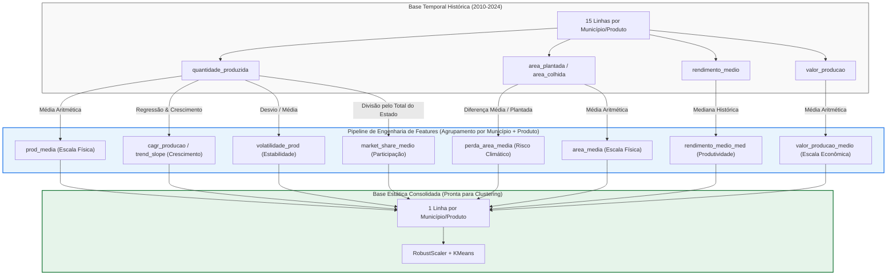

# 📈 Fase 3: Engenharia de Features Temporais

Este documento detalha o pipeline de engenharia de features para converter a série histórica anual (2010 a 2024) de produção agrícola em indicadores analíticos estáticos por Município + Cultura.

---

## 🎯 Objetivos
1. Agrupar os dados históricos consolidados da fase anterior por `municipio_codigo` e `produto`.
2. Criar métricas que reflitam o comportamento temporal histórico do município, evitando análises baseadas em apenas um único ano estático.
3. Computar indicadores de **Escala, Produtividade, Tendência, Volatilidade, Risco Climático e Participação de Mercado**.
4. Salvar a base de features consolidada para modelagem.

---

## 📊 Mapeamento e Definição das Features para a Clusterização

As features foram mapeadas da seguinte forma (escala, produtividade, crescimento, estabilidade e participação relativa):

| Dimensão Oficial do PDF | Feature do Projeto | Descrição | Regra de Negócio / Comportamento Ideal |
| :--- | :--- | :--- | :--- |
| **Escala** | `prod_media`<br>`area_media`<br>`valor_producao_medio` | Média histórica da produção (t), área plantada (ha) e valor da produção (R$ 1.000). | Define o tamanho absoluto e relevância econômica do município. Tratada com `RobustScaler` para evitar que mega-produtores distorçam o modelo. |
| **Produtividade** | `rendimento_medio_med` | Mediana histórica do rendimento médio (kg/ha). | Mede a eficiência técnica da lavoura (o quão produtivo é o solo/manejo), independente do tamanho do município. |
| **Crescimento** | `cagr_producao`<br>`cagr_rendimento`<br>`trend_slope_producao` | CAGR da produção e rendimento (crescimento geométrico) e inclinação linear (Slope) da produção. | **Quanto maior, melhor**. O CAGR resume o crescimento composto de longo prazo, enquanto o Slope avalia a tendência de todos os anos intermediários para blindar o modelo contra anos de seca extrema nas pontas. |
| **Estabilidade** | `volatilidade_prod`<br>`perda_area_media` | Coeficiente de Variação (CV) da produção e taxa média de área plantada perdida (risco climático/operacional). | **Quanto menor, melhor**. O CV avalia o risco/estabilidade geral, e a perda de área mede a vulnerabilidade climática estrutural do município (área plantada vs. colhida). |
| **Participação Relativa** | `market_share_medio` | Média anual de participação do município na produção total do estado do Paraná. | **Quanto maior, melhor**. Mede a dominância regional do município no estado do Paraná, isolando oscilações macroclimáticas gerais. |

---

## 🔄 Fluxo de Transformação e Visualização do Dataset

### 1. O Fluxo Correto: Como as features são geradas
Para cada combinação de **Município + Produto** (ex: Londrina + Soja), o dataset original possui 15 linhas (uma para cada ano de 2010 a 2024). O objetivo da engenharia de features é consolidar essas 15 linhas temporais em uma única linha estática contendo as métricas de interesse para a clusterização:

* **A. Indicadores de "Escala" e "Produtividade":** 
  * `prod_media` = Média aritmética da quantidade produzida (t).
  * `area_media` = Média aritmética da área plantada (ha).
  * `rendimento_medio_med` = Mediana histórica do rendimento médio (kg/ha).
* **B. Indicador de "Market Share" (Participação Relativa):**
  1. Primeiro, calcula-se o Market Share de cada município em cada ano individualmente (ex: $\text{Produção}_{\text{Londrina}, 2010} / \text{Produção}_{\text{PR}, 2010}$).
  2. Com a série temporal de 15 taxas anuais gerada, calcula-se a média aritmética simples dessas participações para obter o `market_share_medio`.
* **C. Indicadores de "CAGR" e "Slope" (Crescimento):**
  * Estes indicadores dependem de forma absoluta da ordem cronológica e do vetor de tempo. 
  * **CAGR:** Identifica o primeiro ano com produção ativa maior que zero e o último ano (2024) e aplica a fórmula de taxa geométrica composta.
  * **Slope:** Utiliza a série temporal histórica de 15 anos em regressão linear simples para estimar a inclinação da tendência de produção.
* **D. Indicador de "Perda Média de Área" (Estabilidade/Risco):**
  1. Primeiro, calcula-se a taxa de perda para cada ano individualmente:
     $$\text{Perda}_t = \frac{\text{Área Plantada}_t - \text{Área Colhida}_t}{\text{Área Plantada}_t}$$
  2. Em seguida, calcula-se a média dessas 15 taxas para obter `perda_area_media`.

### 2. Visualização da Transformação do Dataset

#### Antes da Feature Engineering (Formato Longo Temporal)
Cada município e cultura possui várias linhas correspondentes aos anos históricos contendo todas as colunas consolidadas da Fase 2:

| municipio_codigo | municipio_nome | ano | rendimento_medio | quantidade_produzida | valor_producao | area_colhida | area_plantada | produto |
| :--- | :--- | :--- | :--- | :--- | :--- | :--- | :--- | :--- |
| 4104808 | Cascavel - PR | 2010 | 3120 | 250.000 | 125.000 | 80.000 | 80.000 | soja |
| 4104808 | Cascavel - PR | 2011 | 3290 | 270.000 | 150.000 | 81.500 | 82.000 | soja |
| ... | ... | ... | ... | ... | ... | ... | ... | ... |
| 4104808 | Cascavel - PR | 2024 | 3550 | 320.000 | 280.000 | 89.000 | 90.000 | soja |


#### Depois da Feature Engineering (Tabela de Features Estáticas)
O script realiza o agrupamento (`groupby(["municipio_codigo", "municipio_nome", "produto"])`) e consolida as métricas temporais em uma única linha por município-produto. Este DataFrame final (com apenas 1 linha por município-produto) é o que será enviado como entrada para o `RobustScaler` e para o `KMeans` na Fase 4:

| municipio_nome | produto | prod_media | volatilidade_prod (CV) | cagr_producao | trend_slope_producao | perda_area_media | market_share_medio |
| :--- | :--- | :--- | :--- | :--- | :--- | :--- | :--- |
| Cascavel | soja | 290.000 | 0.06 | 0.018 | 4200.0 | 0.008 | 0.045 |

> [!NOTE]
> **Decisão de Design e Redundância Controlada:**
> Agrupar por `municipio_codigo` e `municipio_nome` simultaneamente é uma redundância lógica (já que o código identifica univocamente o município). Contudo, essa escolha de design foi feita por conveniência analítica para manter o nome legível no DataFrame final de features, evitando a necessidade de realizar um `merge` ou `join` posterior para recuperar os nomes das cidades ao gerar gráficos ou relatórios.

### 3. Racional das Métricas e Fluxograma de Dados

#### 💡 Por que usar a Média Histórica e Métricas Agregadas?
Em vez de analisar um único ano estático (ex: apenas 2024), utilizamos a **série histórica consolidada de 15 anos** para gerar as features estáticas. Isso é fundamental por dois motivos:
1. **Suavização de Anomalias Climáticas**: O agronegócio é altamente vulnerável a fatores externos temporários (secas extremas, geadas, super-safras). Olhar um ano isolado distorceria o perfil real do município. A média e a volatilidade (CV) revelam a capacidade produtiva e a estabilidade estrutural de longo prazo.
2. **Compatibilidade com Algoritmos Estáticos**: Algoritmos de clusterização tradicionais (como o `KMeans`) necessitam de dados tabulares estáticos (1 linha por entidade). A agregação temporal permite "compactar" a dinâmica dos 15 anos sem perder a informação do comportamento histórico.
3. **Dualidade de Crescimento (Escala vs. Eficiência)**: 
   - Calculamos o CAGR duas vezes: para **Produção** (crescimento de escala absoluta em toneladas) e para **Rendimento** (crescimento de eficiência agrícola em kg/ha). Isso permite ao modelo diferenciar municípios que crescem abrindo novas áreas agrícolas daqueles que crescem por avanço tecnológico de solo.
   - O **Slope** é aplicado apenas à produção (uma única vez) para servir de âncora de tendência histórica absoluta e mitigar o impacto de anos de seca nas pontas da série (onde o CAGR falharia). Evitamos aplicar o Slope ao rendimento para prevenir **multicolinearidade** (redundância de features correlacionadas), o que degradaria a performance de agrupamento do `KMeans`.


#### 📊 Fluxo de Consolidação de Dados (Do Temporal ao Estático)



---

## 📐 Fórmulas e Definições das Features

### 1. Volatilidade da Produção (Coeficiente de Variação - CV)
Mede o risco ou a instabilidade relativa da produção ao longo dos anos.
$$\text{CV} = \frac{\sigma(Produção)}{\mu(Produção)}$$
*No Pandas:* `df.groupby(...).std() / df.groupby(...).mean()`.

> [!TIP]
> **Por que usar o Coeficiente de Variação (CV) em vez do Desvio Padrão Puro?**
> O desvio padrão calcula a variação absoluta. Se compararmos um mega-produtor com um pequeno produtor, as variações absolutas seriam incomparáveis. O CV normaliza a variação dividindo-a pela média.
> 
> *   **Cidade A (Mega-Produtora):** Média = 100.000 t, Desvio Padrão = 10.000 t. $\text{CV} = 10.000 / 100.000 = \mathbf{0,10}$ (10% de volatilidade). Produção muito estável.
> *   **Cidade B (Pequeno Produtor):** Média = 5.000 t, Desvio Padrão = 10.000 t. $\text{CV} = 10.000 / 5.000 = \mathbf{2,00}$ (200% de volatilidade). Produção de altíssimo risco/instabilidade.
> 
> O CV permite que o algoritmo `KMeans` compare o risco de ambas as cidades de forma justa, independente de suas escalas físicas.
> 
> **Decisão de Escala para Machine Learning:** Mantemos o CV no formato **decimal** (ex: `0.10` e `2.00`) no banco de dados do modelo, em vez de multiplicá-lo por 100 (porcentagem). Isso evita a inflação de escala dos valores, mantendo a volatilidade alinhada a features como CAGR e Market Share, que também trafegam em formato decimal.
> 
> **Tratamento de Divisão por Zero:** No código, implementamos a trava `if mean_prod > 0 else 0.0`. Caso um município nunca tenha produzido a cultura no histórico (média = 0), a divisão seria indefinida. Essa trava garante o retorno direto de `0.0` para evitar falhas ou valores nulos.


### 2. Taxa de Crescimento Anual Composta (CAGR)
Calcula a taxa média geométrica de crescimento da produção e do rendimento médio ao longo do período.
$$\text{CAGR} = \left( \frac{V_{final}}{V_{inicial}} \right)^{\frac{1}{N}} - 1$$
*Onde:* $V_{final}$ é a produção de 2024, $V_{inicial}$ é a produção de 2010 (ou primeiro ano com dados maiores que zero), e $N$ é o número de anos decorridos.

### 3. Tendência Linear de Crescimento (Slope)
Inclinação da reta de regressão linear para diferenciar municípios em expansão daqueles em declínio ou estáticos.
$$\text{Slope} = \frac{\sum (x - \bar{x})(y - \bar{y})}{\sum (x - \bar{x})^2}$$
*Onde:* $x$ é o Ano (2010-2024) e $y$ é a Quantidade Produzida. Calculado de forma simples em Python usando a função `numpy.polyfit(anos, producao, 1)[0]`.

> [!IMPORTANT]
> **Normalização do Slope para Treinamento (K-Means):**
> O Slope absoluto é fortemente influenciado pela escala do município (um megaprodutor que cresce 5% ao ano tem um slope de milhares de toneladas, enquanto um pequeno produtor tem um slope pequeno, mesmo com a mesma taxa de crescimento). Para o treinamento do K-Means, criamos a feature **`trend_slope_producao_norm`** dividindo o Slope pela produção média histórica do município:
> $$\text{Slope Normalizado} = \frac{\text{Slope Absoluto}}{\text{Produção Média}}$$
> Isso isola o viés da escala física absoluta e representa a taxa de crescimento linear relativo. A feature absoluta original (`trend_slope_producao`) é preservada na base para fins de renderização nos gráficos e tabelas do Dashboard.

### 4. Perda Média de Área (Risco Climático/Operacional)
Mede o percentual médio de área plantada que não chegou a ser colhida (por conta de secas, geadas, pragas, etc.).
$$\text{Perda de Área} = \text{Média} \left( \frac{\text{Área Plantada} - \text{Área Colhida}}{\text{Área Plantada}} \right)$$

### 5. Participação de Mercado (Market Share do Município)
Percentual médio de contribuição da produção daquele município em relação à produção total do estado do Paraná para a mesma cultura em cada ano.
$$\text{Market Share}_{m, t} = \frac{\text{Produção}_{m, t}}{\sum_{i} \text{Produção}_{i, t}}$$

---

## 📝 Blueprint do Código (Estrutura Recomendada para [builder.py](../src/features/builder.py))

Abaixo está a interface implementada na classe `FeatureBuilder` (a lógica interna encontra-se implementada no arquivo [builder.py](../src/features/builder.py)):

```python
from pathlib import Path
import pandas as pd

class FeatureBuilder:
    def __init__(self, processed_data_path: Path):
        """
        Inicializa o construtor de features com o caminho do arquivo processado.
        """
        self.data_path = processed_data_path

    def run(self) -> Path:
        """
        Executa a geração completa de features e salva a base final no formato Parquet.
        """
        pass

    def _build_features(self) -> pd.DataFrame:
        """
        Orquestra as agregações e cálculos temporais (CV, CAGR, Slope, Perda de Área,
        e Market Share) agrupados por municipio_codigo e produto.
        Retorna o DataFrame consolidado de features estáticas por município.
        """
        pass

    def _load_data(self) -> pd.DataFrame:
        """
        Carrega a base consolidada Parquet gerada na Fase 2.
        """
        pass

    def _calculate_slope(self, series: pd.Series) -> float:
        """
        Calcula a inclinação linear (Slope) da série histórica do município/cultura.
        """
        pass

    def _calculate_cagr(self, series: pd.Series) -> float:
        """
        Calcula a Taxa de Crescimento Anual Composta (CAGR) da produção ou rendimento.
        """
        pass

    def _calculate_volatility(self, series: pd.Series) -> float:
        """
        Calcula o Coeficiente de Variação (CV) da série histórica.
        """
        pass
```
