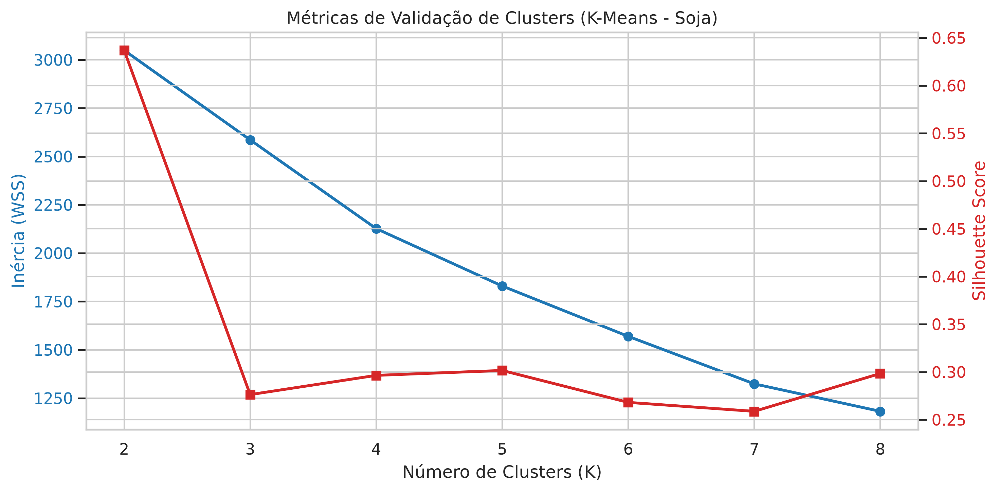
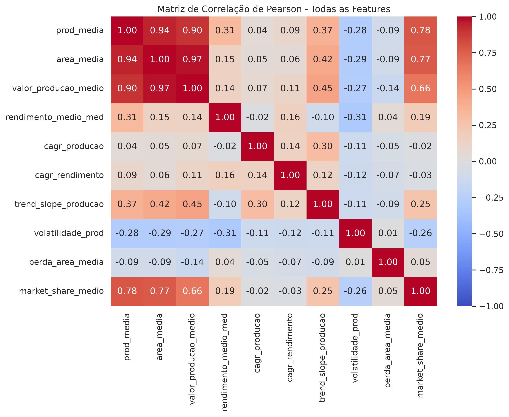
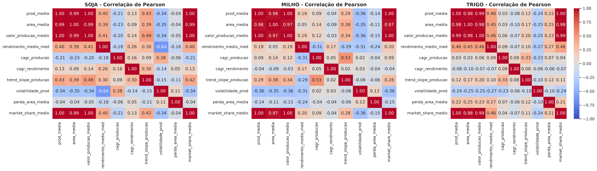

# 🤖 Fase 4: Modelagem e Clusterização

Este documento detalha o pipeline de modelagem não supervisionada para agrupar os municípios do Paraná em perfis produtores semelhantes para soja, milho e trigo.

---

## 🎯 Objetivos
1. Segmentar os municípios utilizando técnicas de aprendizado não supervisionado.
2. Normalizar as métricas de engenharia de features garantindo imunidade a outliers extremos (mega-produtores).
3. **Clusterização Isolada:** Rodar o agrupamento de forma independente para cada uma das três culturas.
4. Escolher a quantidade ótima de grupos baseando-se em métricas matemáticas coesas (**Inércia** e **Silhouette Score**).
5. Rotular e salvar a base final para consumo da API.

---

## 🛠️ Conceitos e Abordagens Críticas

### 1. Normalização dos Dados (`RobustScaler`)
A distribuição da produção agrícola possui municípios extremamente discrepantes (como Cascavel, Castro ou Ponta Grossa que produzem ordens de grandeza acima da média). 
* Um normalizador comum como `StandardScaler` (média/desvio) ou `MinMaxScaler` (mínimo/máximo) é fortemente distorcido por esses outliers.
* Usamos o **`RobustScaler`**, que remove a mediana e escala os dados com base no Intervalo Interquartil (IQR - 25% a 75%), tornando a normalização imune a mega-produtores.

### 2. Segmentação Isolada por Cultura (A Justificativa Técnica)
É mandatório realizar os cálculos e a clusterização de forma totalmente separada para cada tipo de grão (soja, milho e trigo) de forma isolada. Juntar os grãos em uma única média ou cálculo geraria resultados distorcidos e sem valor comercial, devido a três fatores críticos:

1. **Disparidade de Escala e Valor de Mercado:**
   A soja é a cultura dominante no Paraná, movimentando volumes físicos e financeiros gigantescos. O trigo, por ser uma cultura de inverno, possui uma escala de produção e área plantada muito menor. Se unificados, o K-Means seria dominado pela escala da soja, classificando grandes e eficientes polos produtores de trigo simplesmente como "pequenos produtores" genéricos.
2. **Dinâmicas de Crescimento Opostas:**
   Um município pode estar reduzindo a sua área de milho safrinha para expandir agressivamente a produção de soja (ou vice-versa). Ao consolidar as culturas na média, essas tendências opostas se anulam (ex: $+10\%$ em uma e $-10\%$ na outra resultando em crescimento "neutro"), ocultando a verdadeira dinâmica de transição agrícola regional.
3. **Riscos Climáticos Distintos:**
   O trigo (inverno) sofre geadas severas no Paraná, enquanto a soja (verão) sofre mais com secas prolongadas (veranicos). Consolidar a taxa de perda de área camufla o risco real. Investidores e cooperativas precisam saber especificamente: *"Este município é de alto risco para o trigo ou para a soja?"*

#### Como estruturar isso na prática do código:
* **Na Engenharia de Features (`src/features`):** O agrupamento por `municipio_codigo` e `produto` garante que as métricas temporais (CV, CAGR, Slope) sejam geradas de forma isolada para cada grão dentro de cada município:
  ```python
  # O groupby garante o isolamento por grão
  df_features = df.groupby(["municipio_codigo", "municipio_nome", "produto"]).apply(calcular_metricas)
  ```
* **Na Clusterização (`src/models`):** Criação e treinamento de modelos K-Means independentes para cada cultura de forma isolada:
  ```python
  # Exemplo de fluxo para separar e treinar de forma dinâmica por produto
  # i.e. ["soja", "milho", "trigo"]
  crops = df_features["produto"].unique().tolist()
  for crop in crops:
      df_crop = df_features[df_features["produto"] == crop].copy()
      # Treina o RobustScaler e o KMeans especificamente para esta cultura
      df_clustered = clusterer._train_crop_model(df_crop, crop)
  ```

### 3. Validação dos Clusters (Inércia vs. Silhouette)
Para escolher a quantidade ideal de clusters, adotamos a melhor prática de analisar dois indicadores complementares:

* **Inércia (Elbow Method):** Mede a soma das distâncias quadradas dos exemplos para o centroide do seu cluster (coerência interna). Queremos **minimizar a inércia**, buscando o ponto de "retorno decrescente" da curva (o **cotovelo**), a partir do qual adicionar novos clusters traz ganhos marginais de compactação.
* **Silhouette Score:** Mede a coesão interna contra a separação externa (proximidade de cada ponto com pontos do mesmo grupo vs. o grupo vizinho mais próximo). Varia de $-1$ a $+1$. Queremos **maximizar o Silhouette**, buscando o **pico** da curva (maior valor possível), indicando fronteiras de grupo bem delimitadas e sem sobreposição.

> [!TIP]
> **A Regra de Ouro da Complementaridade:**
> * Na **Inércia**, buscamos o **cotovelo** (dobramento da curva).
> * No **Silhouette**, buscamos o **pico** (ponto mais alto).
> Usar ambas em conjunto resolve ambiguidades visuais da inércia. Por exemplo, se o cotovelo da inércia parece sutil entre $K=3$ e $K=4$, a elevação do Silhouette de 0.27 ($K=3$) para 0.29 ($K=4$) confirma matematicamente que $K=4$ oferece grupos muito mais coesos e bem delimitados.


*Figura 3: Curvas de Inércia (Elbow Method em azul) e Silhouette Score (em vermelho) variando K de 2 a 8 para a Soja, evidenciando o pico local de Silhouette em K=4/K=5.*

#### 📊 Tabela de Métricas de Validação (Soja):
| K | Inércia (WSS) | Silhouette Score |
| :---: | :---: | :---: |
| **2** | 3049.7969 | 0.6370 |
| **3** | 2586.2729 | 0.2763 |
| **4** | 2127.1417 | 0.2964 |
| **5** | 1830.0902 | 0.3016 |
| **6** | 1569.6454 | 0.2681 |
| **7** | 1323.8912 | 0.2588 |
| **8** | 1181.7380 | 0.2984 |

> [!NOTE]
> **A Tomada de Decisão: Por que escolher K=4 em vez de K=5?**
> Geometricamente, o valor $K=5$ possui um Silhouette ligeiramente superior ($0.3016$ vs. $0.2964$ em $K=4$). No entanto, a escolha final do projeto recai sobre **$K=4$** pelos seguintes motivos de negócio e modelagem:
> 1. **Parcimônia (Ganho Marginal Irrisório):** O ganho de $0.005$ no Silhouette Score é estatisticamente desprezível e não justifica a complexidade adicional do modelo.
> 2. **Interpretabilidade e Carga Cognitiva:** Quatro clusters mapeiam perfeitamente perfis comerciais acionáveis (Pequenos de Risco, Médios Convencionais, Grandes em Expansão e Super-Gigantes Líderes). Criar um 5º grupo fatiaria os produtores médios em duas subcategorias muito semelhantes, gerando ambiguidade de interpretação para os usuários do dashboard.
> 3. **Definição de Estratégias Comerciais:** Cada um dos 4 clusters suporta uma estratégia de go-to-market distinta (retenção de parceiros líderes, aquisição em polos de rápido crescimento, manutenção padrão ou baixo foco de investimento).

### 4. Tratamento de Multicolinearidade (Correlação de Escala)
As variáveis físicas da dimensão de Escala (`prod_media`, `area_media` e `valor_producao_medio`) possuem altíssima correlação linear (colinearidade) entre si, uma vez que municípios maiores tendem a ter simultaneamente mais área plantada, maior produção e maior faturamento. 

* **O Problema no K-Means:** Como o K-Means baseia-se em distância euclidiana geométrica direta, alimentar o modelo com múltiplas colunas altamente correlacionadas dá "peso duplo ou triplo" para o mesmo conceito analítico subjacente (tamanho/escala), sufocando a importância de outras dimensões como volatilidade, risco ou crescimento.
* **A Analogia com o Mercado Imobiliário:**
  * **Variáveis Redundantes (Escala):** Área total do imóvel ($m^2$), Preço total do imóvel ($R\$$) e IPTU anual são altamente colineares (imóveis maiores tendem a custar mais e pagar mais imposto). Se colocarmos todas, o modelo focará apenas em separar imóveis "grandes" de "pequenos".
  * **Variável Ortogonal (Eficiência):** O valor do metro quadrado ($R\$/m^2$) mede a eficiência/valorização por espaço. Um loft de luxo de $35m^2$ pode ter o mesmo faturamento de uma casa antiga de $300m^2$ na periferia. O tamanho e a eficiência são eixos diferentes.
  * **No Projeto Agrícola:** Dropar `area_media` e `valor_producao_medio` no treinamento equivale a remover a redundância física/financeira. Mantemos apenas **`prod_media`** (como representante da Escala) e **`rendimento_medio_med`** (equivalente ao valor do $m^2$, representando a Eficiência Agrícola).

  * **Justificativa de Escolha da Âncora de Escala (`prod_media`):**
    A escolha de manter a produção física (`prod_media`) em detrimento da área (`area_media`) ou do valor financeiro (`valor_producao_medio`) foi pautada por critérios técnicos e de negócios da Coamo:
    1. **Relevância Logística:** A infraestrutura de cooperativas agrícolas (silos, capacidade de recepção e escoamento) é dimensionada diretamente pela quantidade física de grãos em toneladas, tornando a produção a variável de maior impacto operacional.
    2. **Estabilidade contra Oscilações de Mercado:** O valor de produção ($R\$$) é fortemente influenciado por inflação, flutuação cambial (dólar) e volatilidade do valor das commodities. A produção em toneladas nos dá uma métrica física e estável ao longo dos 14 anos analisados.
    3. **Foco na Produção Efetiva:** A área plantada reflete o potencial de terra, mas não a eficiência de colheita. Municípios com grandes áreas e técnicas rudimentares teriam peso inflado. A produção física capta o resultado final consolidado.

  * **O Caso do `market_share_medio` (Redundância Oculta):** Em uma análise de correlação na base geral (com todas as culturas misturadas), a correlação entre `prod_media` e `market_share_medio` é de **0.7816**. No entanto, quando analisada **de forma isolada por cultura** (Soja, Milho ou Trigo separadamente), a correlação salta para o intervalo entre **0.97 e 1.00**. Isso comprova matematicamente dois pontos cruciais:
    1. **Justificativa do Isolamento:** As culturas operam em escalas físicas de produção completamente distintas (ex: toneladas de soja vs. trigo), o que causaria distorções se fossem agrupadas em um único modelo de dados.
    2. **Remoção de Feature:** Como cada modelo K-Means roda de forma isolada por cultura, o `market_share_medio` torna-se redundante com a `prod_media` no espaço interno de cada modelo, justificando o seu descarte das features de treinamento para evitar dar peso duplo à dimensão de escala.
* **Estratégia de Resolução no Código:** No projeto, todas as variáveis são expostas na API e no Dashboard para análise do usuário. No entanto, para o ajuste do clusterizador, a lista padrão de treinamento (`feature_cols`) descarta `area_media`, `valor_producao_medio` e `market_share_medio`, utilizando apenas a `prod_media` como âncora de escala, mitigando o viés de sobre-representação.

#### 📊 Visualização Gráfica da Correlação:
Abaixo estão os mapas de calor (heatmaps) gerados durante a análise exploratória, comprovando os padrões de colinearidade descritos:


*Figura 1: Matriz de Correlação de Pearson para todo o conjunto consolidado, exibindo a correlação de 0.78 do Market Share.*


*Figura 2: Matriz de Correlação de Pearson dividida por cultura, demonstrando que a colinearidade do Market Share com as variáveis de escala sobe para >0.97 quando isolada.*

### 5. Perfis Esperados de Agrupamento (Interpretabilidade dos Clusters)
O modelo K-Means analisa todas as dimensões mapeadas ao mesmo tempo (já normalizadas para que o tamanho físico não esmague os outros dados). Ao cruzar essas características, a expectativa é a identificação de grupos lógicos bem definidos, por exemplo:
* **Cluster A (Os Gigantes Estáveis):** Market Share alto, volatilidade (CV) baixa (estável), Slope positivo (crescendo) e perda de área baixa (baixo risco).
* **Cluster B (Os Emergentes Rápidos):** Market Share pequeno/médio, CAGR e Slope muito elevados (crescimento acelerado) e volatilidade média.
* **Cluster C (Os Voláteis de Alto Risco):** Market Share instável, volatilidade (CV) muito alta (picos e vales) e perda de área média/alta (regiões ciclicamente afetadas pelo clima).

---

## 📊 Mapeamento e Definição das Features para a Clusterização

Para a clusterização, as dimensões oficiais do desafio foram traduzidas em features específicas do projeto, cada uma com sua respectiva regra de negócio e comportamento esperado:

| Dimensão Oficial do PDF | Feature do Projeto | Descrição | Regra de Negócio / Comportamento Ideal |
| :--- | :--- | :--- | :--- |
| **Escala** | `prod_media`<br>`area_media`<br>`valor_producao_medio` | Média histórica da produção (t), área plantada (ha) e valor da produção (R$ 1.000). | Define o tamanho absoluto e relevância econômica do município. Tratada com `RobustScaler` para evitar que mega-produtores distorçam o modelo. |
| **Produtividade** | `rendimento_medio_med` | Mediana histórica do rendimento médio (kg/ha). | Mede a eficiência técnica da lavoura (o quão produtivo é o solo/manejo), independente do tamanho do município. |
| **Crescimento** | `cagr_producao`<br>`cagr_rendimento`<br>`trend_slope_producao` | CAGR da produção e rendimento (crescimento geométrico) e inclinação linear (Slope) da produção. | **Quanto maior, melhor**. O CAGR resume o crescimento composto de longo prazo, enquanto o Slope avalia a tendência de todos os anos intermediários para blindar o modelo contra anos de seca extrema nas pontas. |
| **Estabilidade** | `volatilidade_prod`<br>`perda_area_media` | Coeficiente de Variação (CV) da produção e taxa média de área plantada perdida (risco climático/operacional). | **Quanto menor, melhor**. O CV avalia o risco/estabilidade geral, e a perda de área mede a vulnerabilidade climática estrutural do município (área plantada vs. colhida). |
| **Participação Relativa** | `market_share_medio` | Média anual de participação do município na produção total do estado do Paraná. | **Quanto maior, melhor**. Mede a dominância regional do município no estado do Paraná, isolando oscilações macroclimáticas gerais. |

> [!NOTE]
> **Média vs. Mediana (Resumo de Design Estatístico):**
> * **Mediana para Produtividade (`rendimento_medio_med`):** Filtra anos de catástrofes climáticas atípicas (outliers negativos) e revela o real patamar tecnológico do produtor.
> * **Média para Perdas (`perda_area_media`):** Mantida para perdas pois precisamos medir o risco acumulado. Se usássemos a mediana, as secas históricas pontuais seriam zeradas da estatística, mascarando o risco do município.

---

## 📝 Blueprint do Código (Estrutura Recomendada para `src/models/clusterer.py`)

Abaixo está o fluxo recomendado para construir a classe `AgriculturalClusterer`:

```python
import pandas as pd
from pathlib import Path

class AgriculturalClusterer:
    def __init__(
        self,
        features_path: str | Path,
        output_path: str | Path,
        n_clusters: int = 4,
        random_state: int = 42,
    ):
        """
        Inicializa o orquestrador do pipeline de modelagem e clusterização.
        """
        self.features_path = Path(features_path)
        self.output_path = Path(output_path)
        self.n_clusters = n_clusters
        self.random_state = random_state
        
    def _load_features(self) -> pd.DataFrame:
        """
        Carrega a base de features consolidada do Parquet.
        """
        pass

    def _train_crop_model(self, df_crop: pd.DataFrame, crop_name: str) -> pd.DataFrame:
        """
        Aplica o RobustScaler sobre as features selecionadas e executa a clusterização
        (K-Means/K-Medoids) de forma isolada para os dados de uma cultura específica.
        Retorna o DataFrame original com a coluna 'cluster' rotulada e ordenada pela produção média.
        """
        pass

    def run_pipeline(self) -> pd.DataFrame:
        """
        Executa a clusterização de todas as culturas e consolida os resultados,
        salvando a base final de clusters em disco.
        """
        pass
```
