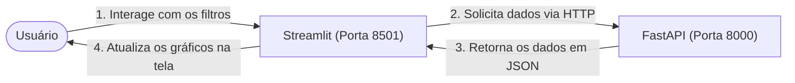

# 🎨 Fase 6: Dashboard de Visualização (Streamlit)

Este documento descreve as especificações técnicas, componentes de interface e regras de comunicação com o backend necessárias para construir o dashboard de visualização interativo em Streamlit.

---

## 🎯 Objetivos
1. Desenhar uma interface gráfica interativa simples para demonstração do produto final do desafio.
2. **Desacoplamento de Arquitetura (Regra de Ouro):** Garantir que o Dashboard se comunique com os dados **apenas através da API FastAPI**, sem realizar nenhuma leitura direta dos arquivos Parquet ou modelos salvos em disco.
3. Permitir filtros dinâmicos na barra lateral (cultura, ano, município e métrica).
4. Renderizar painéis de séries temporais históricas, rankings de produtores e a visualização dos perfis de clusters gerados.

---

## 🔌 Comunicação Frontend-Backend (Exemplo)
O dashboard deve utilizar a biblioteca `requests` para conversar com a API local (rodando em `http://localhost:8000`).



---

## 📝 Blueprint do Código (Estrutura Recomendada para `src/dashboard/app.py`)

Abaixo está o fluxo lógico estruturado para criar o seu aplicativo Streamlit:

```python
import streamlit as st
import requests
import pandas as pd

# URL base da API FastAPI
API_URL = "http://localhost:8000"

st.set_page_config(
    page_title="PAM Analytics Dashboard",
    layout="wide",
    initial_sidebar_state="expanded"
)

st.title("🌾 PAM Analytics - Painel de Clusterização Agrícola do Paraná")

# 1. Carregar Metadata da API FastAPI para popular os filtros dinâmicos (GET /metadata)
# 2. Desenhar a barra lateral de filtros (Cultura, Ano, Município para Série Histórica)
# 3. Desenhar o painel principal estruturado em abas com st.tabs:
#    - Aba 1: Gráfico temporal de evolução física/financeira (GET /series)
#    - Aba 2: Gráfico de barras com o ranking dos produtores (GET /ranking)
#    - Aba 3: Tabelas de perfis descritivos dos clusters e listagem de municípios (GET /clusters)
# (A implementação completa do frontend em Streamlit encontra-se no arquivo src/dashboard/app.py)
```
