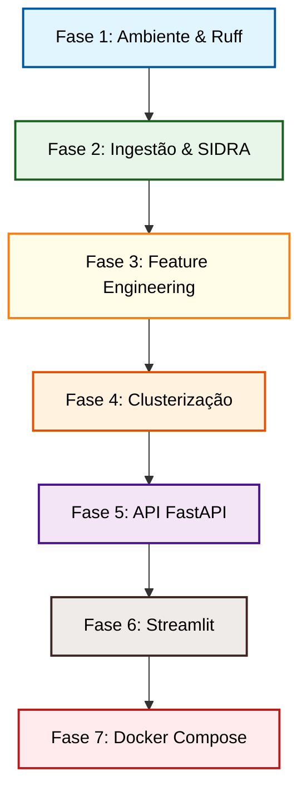

# Roadmap de Desenvolvimento: Desafio Técnico - Cientista de Dados Pleno

Este roadmap foi desenhado para apoiar o seu desenvolvimento **manual** do projeto, garantindo que você compreenda profundamente cada linha de código escrita. A melhor forma de se preparar para a entrevista técnica é ter total controle sobre as decisões de engenharia e modelagem tomadas em cada etapa.

---



---

## 🚀 Fase 1: Configuração do Ambiente e Padrões de Código
**Objetivo:** Deixar o seu ambiente Python pronto, limpo e integrado com ferramentas de linting.

### 📝 O que fazer:
1. **Instalar Dependências:** Crie seu ambiente virtual `.venv`, ative-o e instale as dependências usando os comandos sugeridos com base no seu arquivo [pyproject.toml](file:///home/nanshibukawa/Documents/pam-analytics/pyproject.toml).
2. **Configurar IDE:** Instale a extensão do **Ruff** no seu editor de código e ative o *Format on Save*.
3. **Estrutura de Pastas:** Crie manualmente a árvore de pastas no terminal dentro de `pam-analytics/`:
   ```bash
   mkdir -p src/ingestion src/features src/models src/api src/dashboard tests data/raw data/processed docker
   touch src/__init__.py src/ingestion/__init__.py src/features/__init__.py src/models/__init__.py src/api/__init__.py
   ```

### 🧠 O que você vai aprender nessa fase:
* Gerenciamento moderno de dependências em Python utilizando o padrão PEP 621 (`pyproject.toml`).
* Como ferramentas de análise estática (`ruff`) garantem a legibilidade e evitam erros de sintaxe e estilo (PEP 8) de forma automatizada.

### 🛡️ Defesa na Entrevista:
> *"Iniciei o projeto configurando um ambiente isolado com `pyproject.toml` e definindo regras estritas de linting e formatação via Ruff. Isso garante a reprodutibilidade do projeto para qualquer desenvolvedor e mantém a padronização estilística do código desde o primeiro dia."*

---

## 📥 Fase 2: Pipeline de Ingestão e Iniciação dos Dados
**Objetivo:** Consumir os dados da API pública do SIDRA com resiliência e salvá-los localmente de forma tratada.

### 📝 O que fazer:
1. **Escrever o Cliente HTTP (`src/ingestion/client.py`):**
   * Use a biblioteca `requests`.
   * Implemente um loop de tentativas (*retries*) com um atraso de tempo crescente (*backoff exponencial*) em caso de falha HTTP.
2. **Escrever a Pipeline de Dados (`src/ingestion/pipeline.py`):**
   * Monte programaticamente a URL de consulta do SIDRA fatiada por produto.
   * Colete as respostas brutas em JSON e converta em DataFrame do Pandas.
   * Substitua os valores nulos e especiais do IBGE (`-`, `..`, `...`) por numéricos ou `NaN`.
   * **Super Trunfo:** Use os códigos numéricos das variáveis (`D2C`) na pivotagem da tabela para evitar quebras por acentuação.
   * Salve o DataFrame consolidado no formato **Parquet** em `data/processed/`.

### 🧠 O que você vai aprender nessa fase:
* Como construir requisições REST parametrizadas.
* Conceitos de engenharia de dados como resiliência de rede (Retry/Backoff).
* Manipulação avançada de dados com Pandas: limpeza de dados sujos, pivotagem e otimização de armazenamento (CSV vs. Parquet).

### 🛡️ Defesa na Entrevista:
> *"Estruturei a ingestão dividindo as requisições por cultura (Crop Chunking) para contornar o limite de 50.000 células da API do SIDRA. Implementei retries com backoff exponencial para lidar com instabilidades do servidor do IBGE. Além disso, fiz a pivotagem dos dados utilizando os códigos imutáveis das variáveis (D2C) em vez de strings, garantindo robustez de dados. Os dados finais foram salvos em Parquet para otimizar espaço e preservar a tipagem exata das colunas."*

---

## 📈 Fase 3: Engenharia de Features Temporais
**Objetivo:** Transformar dados anuais históricos em métricas consolidadas de comportamento por Município + Produto.

### 📝 O que fazer:
1. **Escrever o Builder (`src/features/builder.py`):**
   * Calcule estatísticas básicas por município-produto (Média e Desvio Padrão da Produção).
   * Calcule o Coeficiente de Variação (CV) para isolar a volatilidade.
   * Crie uma função auxiliar para calcular o **CAGR** da produção e do rendimento médio.
   * Crie uma função auxiliar para calcular o **Slope** (inclinação linear) da tendência de produção.
   * Extraia a taxa média de perda de área (diferença entre Área Plantada e Colhida).
   * Calcule o *Market Share* médio de cada município em relação ao estado.

### 🧠 O que você vai aprender nessa fase:
* Como agregar dados temporais preservando a inteligência histórica.
* Diferença matemática entre crescimento composto (CAGR) e tendência linear (Slope).
* Como traduzir conceitos de negócios agrícolas (perda de área, volatilidade e representatividade) em fórmulas matemáticas concretas.

### 🛡️ Defesa na Entrevista:
> *"Em vez de focar apenas no último ano de dados, criei métricas históricas de 2010 a 2024 para cada município e cultura. Features como o Coeficiente de Variação (CV) capturam a volatilidade, enquanto o CAGR e o Slope diferenciam produtores em franca expansão de produtores consolidados e estáticos. A taxa de perda de área foi introduzida como uma métrica de risco operacional e climático."*

---

## 🤖 Fase 4: Modelagem e Clusterização Agrícola
**Objetivo:** Agrupar municípios em perfis produtivos semelhantes e validar estatisticamente a separação.

### 📝 O que fazer:
1. **Escrever o Clusterizador (`src/models/clusterer.py`):**
   * Importe e configure o **RobustScaler** para normalizar as features.
   * **Super Trunfo:** Certifique-se de filtrar a base de features e rodar a clusterização de forma **isolada para cada cultura** (soja, milho, trigo).
   * Implemente o K-Means (ou K-Medoids se instalar o `scikit-learn-extra`).
   * Implemente o método de avaliação de clusters (`evaluate_k`) para calcular e imprimir o Silhouette Score e a Inércia (Elbow Method).
   * Salve o mapeamento final de municípios e seus respectivos clusters de volta em um arquivo Parquet (ou banco de dados local).

### 🧠 O que você vai aprender nessa fase:
* Como tratar dados com outliers usando normalizações robustas.
* O funcionamento matemático da clusterização e as diferenças entre centroides matemáticos (K-Means) e pontos reais (K-Medoids).
* Métricas estatísticas de validação não-supervisionada (Silhouette e Inércia).

### 🛡️ Defesa na Entrevista:
> *"Utilizei o RobustScaler no pré-processamento porque a distribuição de produção agrícola possui megaprodutores muito discrepantes, o que distorceria a média de um StandardScaler convencional. A clusterização foi rodada de forma independente por cultura (soja, milho e trigo), pois as ordens de grandeza física e econômica de produção entre elas são incompatíveis e enviesariam o agrupamento se misturadas. Utilizei o Silhouette Score e o Método do Cotovelo para justificar a escolha de X clusters."*

---

## 🔌 Fase 5: API de Exposição (FastAPI)
**Objetivo:** Expor os resultados gerados em endpoints rápidos e seguros.

### 📝 O que fazer:
1. **Escrever o Ponto de Entrada (`src/api/main.py`):**
   * Inicialize a aplicação FastAPI.
   * Implemente o endpoint `GET /health` retornando o status do serviço.
   * Implemente o endpoint `GET /metadata` retornando as opções disponíveis de municípios, anos e culturas.
   * Implemente endpoints parametrizados para retornar séries históricas (`GET /series`), rankings (`GET /ranking`) e volumetria de clusters (`GET /clusters`).
2. **Validar com Pydantic (`src/api/schemas.py`):**
   * Crie classes Pydantic para estruturar e validar o formato de saída de cada endpoint.

### 🧠 O que você vai aprender nessa fase:
* Como criar serviços REST rápidos usando programação assíncrona em Python (`async`/`await`).
* Conceito de serialização e validação de dados via Pydantic.
* Como desacoplar a camada de dados (leitura do Parquet) da camada de transporte (endpoints HTTP).

### 🛡️ Defesa na Entrevista:
> *"Utilizei FastAPI pela alta performance nativa e suporte automático a documentação Swagger (/docs). Criei esquemas estritos com Pydantic para garantir que as saídas da API fossem sempre validadas, consistentes e documentadas. Toda a leitura de dados de séries e clusters consome as bases Parquet otimizadas geradas nos módulos anteriores."*

---

## 🎨 Fase 6: Dashboard de Visualização (Streamlit)
**Objetivo:** Apresentar os dados de forma interativa e amigável.

### 📝 O que fazer:
1. **Escrever o App (`src/dashboard/app.py`):**
   * Importe a biblioteca `streamlit` e `requests` (para consultar a sua API local do FastAPI).
   * **Regra de Ouro:** O dashboard **nunca** deve acessar a base de dados Parquet diretamente. Ele deve se comunicar estritamente via requisições HTTP para a API na porta `8000`.
   * Crie filtros interativos na barra lateral (cultura, ano, métricas).
   * Desenhe visualizações gráficas (gráficos de linha para séries temporais, gráficos de barra para rankings).
   * Plotar a distribuição dos clusters (um gráfico de dispersão 2D ou um mapa simples).

### 🧠 O que você vai aprender nessa fase:
* Conceito de arquitetura cliente-servidor (Dashboard desconectado do banco de dados).
* Como construir interfaces de dados ágeis e interativas.

### 🛡️ Defesa na Entrevista:
> *"O Dashboard Streamlit atua exclusivamente como uma camada de apresentação de dados (Frontend), consumindo de forma síncrona a API FastAPI (Backend). Isso garante que, se no futuro trocarmos o Streamlit por uma interface em React ou mudarmos a fonte de dados do backend, o acoplamento de código seja mínimo."*

---

## 🐳 Fase 7: Containerização e Orquestração (Docker)
**Objetivo:** Empacotar todo o sistema para rodar com um único comando em qualquer computador.

### 📝 O que fazer:
1. **Escrever os Dockerfiles (`docker/`):**
   * Crie o `docker/api.Dockerfile` expondo a porta `8000`.
   * Crie o `docker/dashboard.Dockerfile` expondo a porta `8501`.
2. **Escrever a Orquestração (`docker-compose.yml`):**
   * Configure os dois serviços no arquivo `docker-compose.yml`.
   * Defina as portas locais corretas (`8000:8000` e `8501:8501`).
   * Garanta que o dashboard aguarde a API estar ativa para iniciar (usando healthcheck ou rede compartilhada).
3. **Testar a execução global:**
   * Execute no terminal da raiz:
     ```bash
     docker compose up --build
     ```

### 🧠 O que você vai aprender nessa fase:
* O funcionamento e isolamento de containers Docker.
* Como criar redes internas virtuais compartilhadas entre containers.
* Orquestração básica de multi-serviços.

### 🛡️ Defesa na Entrevista:
> *"Empacotei todo o ecossistema com Docker Compose. Criei Dockerfiles otimizados de múltiplos estágios para a API FastAPI e o Dashboard Streamlit. A comunicação interna ocorre em uma rede Docker privada, permitindo que a solução inteira suba perfeitamente de forma isolada em qualquer máquina host sem necessidade de configurações manuais locais."*
